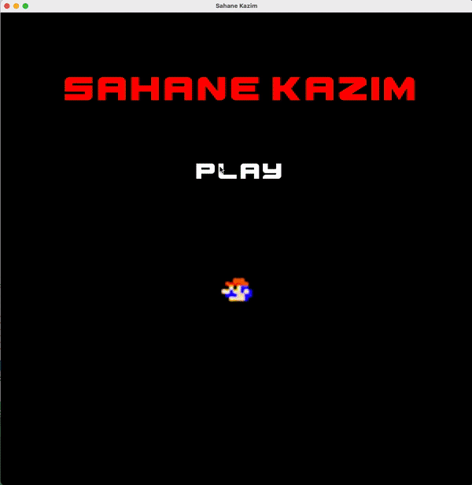

# Mario
## OOP Term Project


To build and execute to project:

1. Go to /build directory 
2. Add CMAKE_PREFIX_PATH for SFML
    For example:
```
cmake -D CMAKE_PREFIX_PATH=/usr/local/Cellar/sfml/2.5.1_2 .
```
(Refer to:
https://stackoverflow.com/questions/33251390/cmake-find-package-not-finding-findpackage-cmake

https://dane-bulat.medium.com/cmake-building-sfml-and-game-projects-on-linux-3947b3ba6e8
)

3. Build the project (in build directory)
```
make
```
4. Play the game!
```
./mario
```



## Dependencies

- SFML
- spdlog


